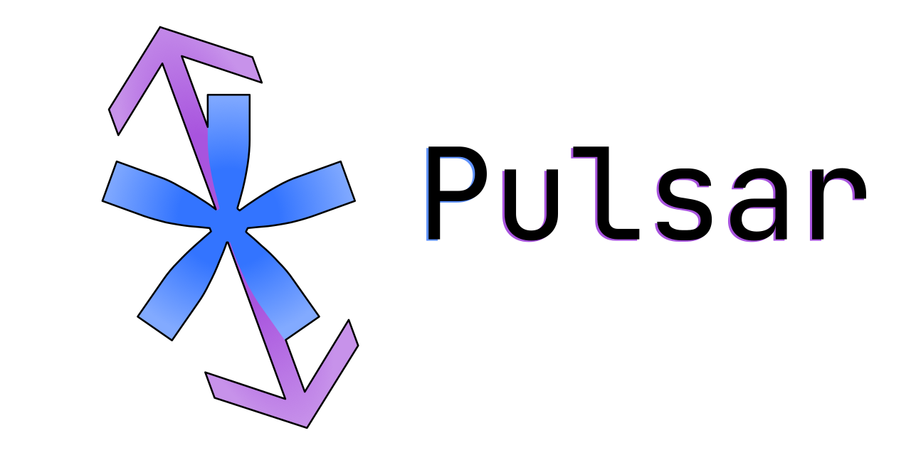

# Pulsar Examples

Welcome to the examples folder of Pulsar.

Here you'll find examples separated into 3 categories:
1. Basic
2. Intermediate
3. Advanced

As you can see they're split based on "complexity". Each folder
has examples ordered based on knowledge required to read them
(i.e. example 00 must be understood before 01) or complexity
within their category.

I'd strongly recommend to read the [docs/LANGUAGE](docs/LANGUAGE.md)
first, as some examples take things for granted (like instructions).

Have fun digging through Pulsar!

